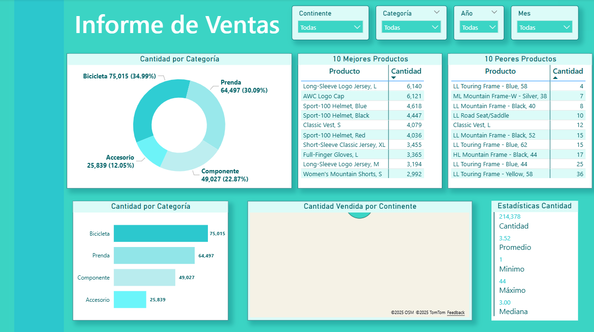
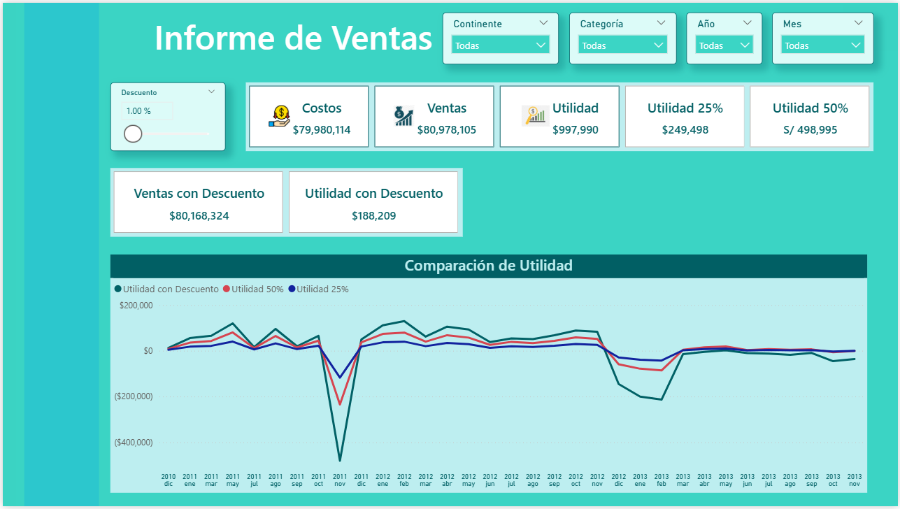
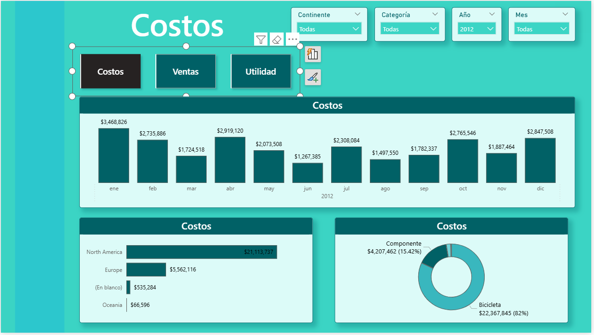
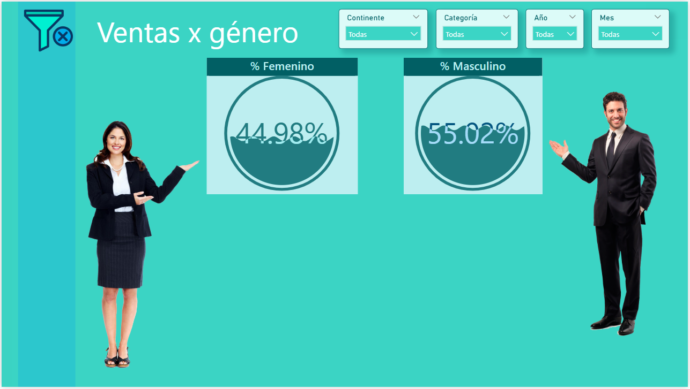

## 📑 Contenido
1. [Visión general del proyecto](#-visión-general-del-proyecto)
2. [Capturas del dashboard](#-capturas-del-dashboard)
3. [Explorar el dashboard en línea](#-explorar-el-dashboard-en-línea)
4. [Hallazgos clave](#-hallazgos-clave)

## 📌 Visión general del proyecto

Este proyecto presenta un **Informe de Ventas** desarrollado en **Power BI**, cuyo objetivo es analizar el desempeño comercial a través de diferentes perspectivas: categorías de productos, canales de venta (mayorista y minorista), costos, utilidad y proyecciones financieras.  

El tablero permite identificar los productos más y menos vendidos, analizar la distribución de las ventas por género, proyectar utilidades aplicando descuentos, y comprender mejor el impacto de los costos en la rentabilidad.  
Además, incluye un apartado técnico con ejemplos prácticos del uso de funciones DAX como **ALL** y **ALLSELECTED**.

## Objetivo
Proporcionar un análisis integral de las ventas, costos y utilidades, de manera que se puedan identificar tendencias, oportunidades de mejora y escenarios futuros que apoyen la toma de decisiones estratégicas.

## 📊 Fuente de datos
- **Institución/Fuente:** Datos ficticios de ventas simuladas para fines académicos.
- **Fecha de actualización:** 2024.
- **Periodo cubierto:** 2011 - 2012.

## 🛠️ Herramientas utilizadas
- **Power BI** (visualización y modelado de datos)
- **Power Query** (limpieza y transformación de datos)
- **Excel** (fuente principal de datos)
- **DAX** (medidas personalizadas, KPIs y proyecciones)

## Contenido principal del dashboard

**Principales métricas:**
- **Ventas Totales:** $80,978,105  
- **Costos Totales:** $79,980,114  
- **Utilidad:** $997,990  
- **Margen de Utilidad Bruta (MUB):** 1.23%  
- **Margen de Utilidad Neta (MUN):** 1.23%  
- **Crecimiento de Ventas:** 82.35%  

## 🖼️ Capturas del dashboard

A continuación, se presentan las principales vistas del tablero:

### 1. Página de inicio – Informe de Ventas
Incluye un resumen con la **cantidad de productos vendidos**, su distribución por categoría, además de los **10 mejores y 10 peores productos**.  

### 2. Ventas 
Resumen ejecutivo con indicadores clave como costos, ventas, utilidad, márgenes y crecimiento de ventas.  

### 3. Proyección
Permite simular el impacto de un descuento en las ventas y utilidad, mostrando la evolución temporal en un **gráfico comparativo de escenarios**.  

### 4. Costos
Desglose de costos por **mes, continente y categoría**, destacando que la categoría **Bicicletas** concentra el 82% de los costos.  

### 5. Filtros – ALL y ALLSELECTED
Ejemplo técnico sobre el uso de funciones DAX para comprender cómo afectan los filtros en cálculos como el total de órdenes y promedios por categoría.  

### 6 y 7. Ventas por canal – Mayor y Menor
Muestra la distribución de las ventas entre el canal **mayorista** ($24,110,322 – 29.77%) y el canal **minorista** ($56,867,783 – 70.23%).  

### 8. Ventas por género
Analiza la participación de las ventas según el género del cliente.  

## 🔗 Explorar el dashboard en línea

Puedes explorar el dashboard de manera interactiva directamente desde Power BI Service.  

> **Nota:** Si el enlace no se abre correctamente, revisa que estés usando un navegador compatible y que tengas conexión estable.

**[Click aquí para ver el dashboard en línea](https://app.powerbi.com/view?r=eyJrIjoiMTRmM2I4MDEtNjFjMi00YmNmLTg4ZDktZDc2MDE1N2IxMjdhIiwidCI6IjFlYmE0NDNmLTIzZTUtNDUzNC05MGQxLTA5NzZhYWJlODZhYyIsImMiOjR9)**

## 📌 Hallazgos clave

1. El **canal minorista concentra el 70.23% de las ventas**, mientras que el mayorista aporta solo el 29.77%.  
2. La categoría **Bicicletas es la más relevante**, con el 34.99% de la cantidad de productos vendidos y el 82% de los costos totales.  
3. El producto más vendido es **“Long-Sleeve Logo Jersey, L”** (6,140 unidades), mientras que el menos vendido es **“LL Touring Frame - Yellow, 58”** (36 unidades).  
4. La utilidad neta es relativamente baja (**$997,990**), lo que sugiere un margen muy ajustado (1.23%) pese al volumen de ventas.  
5. La página de **Proyección** revela que pequeños descuentos pueden reducir drásticamente la utilidad, mostrando la sensibilidad del negocio frente a estas decisiones.  
6. En el análisis por género, se observa una diferencia no muy significativa (menor al 5%) de las ventas femeninas (44.98%) frente a las masculinas (55.02%).  
7. El módulo de **Filtros (ALL y ALLSELECTED)** es clave para entender cómo se comportan las medidas en diferentes contextos de segmentación.  