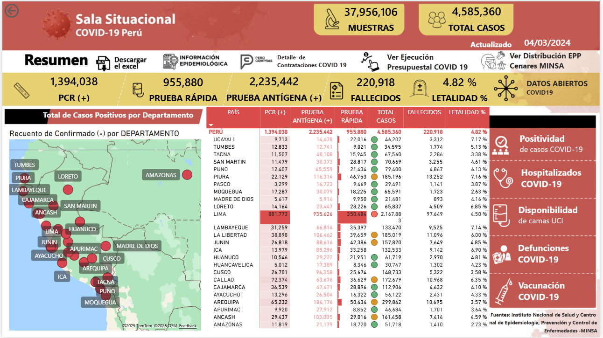
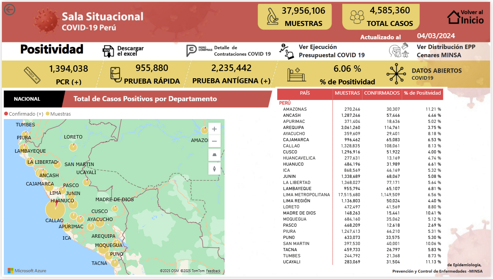
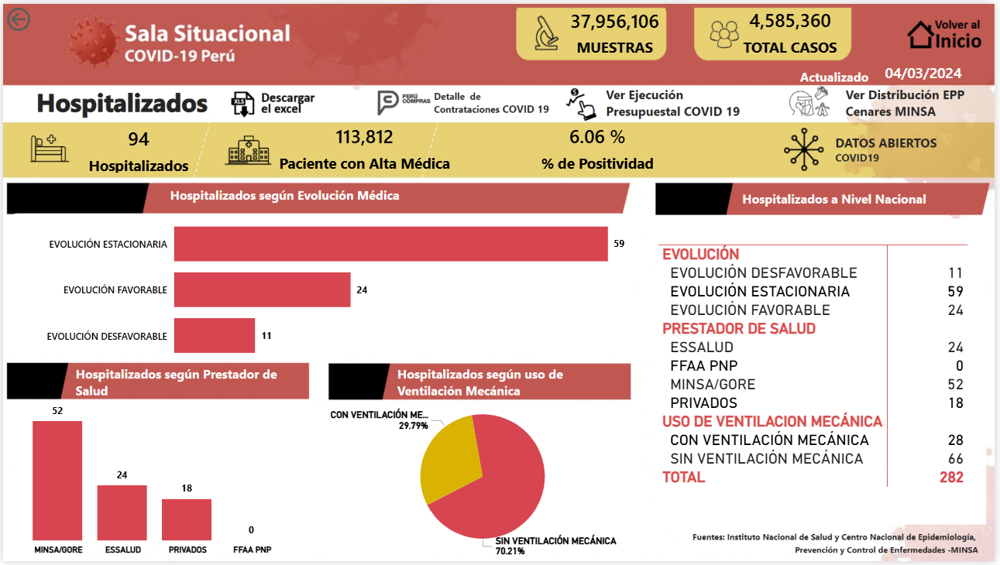
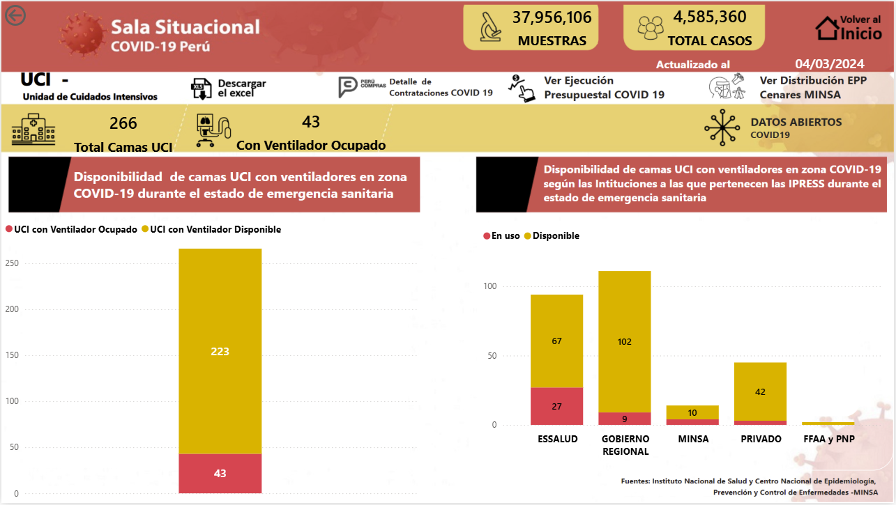
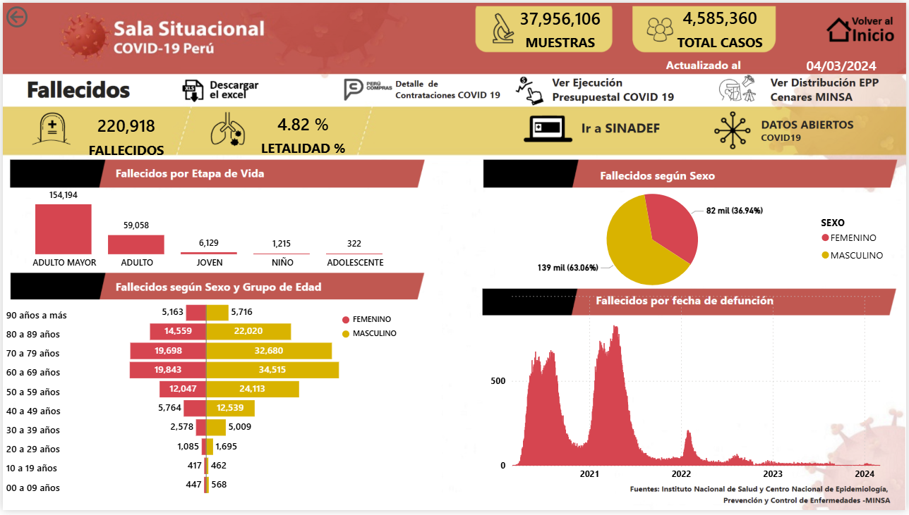

## 📑 Contenido
1. [Visión general del proyecto](#-visión-general-del-proyecto)
2. [Capturas del dashboard](#-capturas-del-dashboard)
3. [Explorar el dashboard en línea](#-explorar-el-dashboard-en-línea)
4. [Hallazgos clave](#-hallazgos-clave)

## 📌 Visión general del proyecto

Este proyecto presenta un análisis integral de la evolución del **COVID-19 en el Perú** a través de un tablero interactivo desarrollado en **Power BI**.  
Su propósito es ofrecer una visión clara y dinámica del impacto de la pandemia en el país, integrando datos oficiales del **Ministerio de Salud (MINSA)** y del **Centro Nacional de Epidemiología, Prevención y Control de Enfermedades (CDC Perú)**.

El dashboard combina indicadores clave como casos confirmados, defunciones, letalidad, positividad y disponibilidad de camas UCI, complementados con segmentaciones por departamento, etapa de vida, sexo y grupo etario.  
De esta forma, el usuario puede explorar desde una visión global de la pandemia hasta un nivel de detalle por región o grupo poblacional.

## Objetivo
Proporcionar una visión general y detallada de la situación del COVID-19 en el Perú, permitiendo explorar la información a nivel nacional y por departamento, para identificar tendencias, grupos más afectados y capacidad hospitalaria.

## 📊 Fuente de datos
- **Institución:** Ministerio de Salud (MINSA) y Centro Nacional de Epidemiología, Prevención y Control de Enfermedades (CDC Perú).
- **Fecha de actualización:** 04/03/2024.
- **Periodo cubierto:** 2021 - 2024.

## 🛠️ Herramientas utilizadas
- **Power BI** (visualización y modelado de datos)
- **Power Query** (limpieza y preparación de datos)
- **Excel** (fuente principal de los datos)
- **DAX** (cálculos de métricas y medidas personalizadas)

## 📈 Contenido principal del dashboard

**Principales métricas:**
- **Total de Muestras:** 37,956,106
- **Total de Casos:** 4,585,360
- **Fallecidos:** 220,918
- **Letalidad %:** 4.82%
- **Total Camas UCI:** 266
- **Camas UCI ocupadas con ventilador:** 43

## 🖼️ Capturas del dashboard

A continuación, se presentan vistas principales del tablero en el mismo orden que se muestran en Power BI:

### 1. Página de inicio

### 2. Positividad de casos

### 3. Hospitalizados

### 4. Disponibilidad de camas UCI

### 5. Defunciones por etapa de vida, sexo y grupo etario

## 🔗 Explorar el dashboard en línea

Puedes explorar el dashboard de manera interactiva directamente desde Power BI Service, sin necesidad de descargar archivos.  

> **Nota:** Si el enlace no se abre correctamente, revisa que estés usando un navegador compatible y que tengas conexión estable.

**[Ver dashboard en línea](https://app.powerbi.com/view?r=eyJrIjoiOGNmMzk2ZWEtMzc3MC00ZWZlLTgwMDItZGU5NGY5MmVhYWFhIiwidCI6IjFlYmE0NDNmLTIzZTUtNDUzNC05MGQxLTA5NzZhYWJlODZhYyIsImMiOjR9)**

## 📌 Hallazgos clave

1. La **letalidad general** del COVID-19 en Perú es del **4.82%**, lo que refleja un impacto significativo en la población.
2. El **grupo de Adulto Mayor** concentra la mayor cantidad de defunciones, evidenciando una mayor vulnerabilidad en este segmento.
3. La **capacidad de camas UCI con ventilador es limitada**, con **43 ocupadas de 266 disponibles**, lo que representa un riesgo ante un aumento repentino de casos críticos.
4. Existe una **mayor proporción de defunciones en hombres** (**63.06%**) en comparación con mujeres (**36.94%**), lo que sugiere diferencias de impacto según el género.