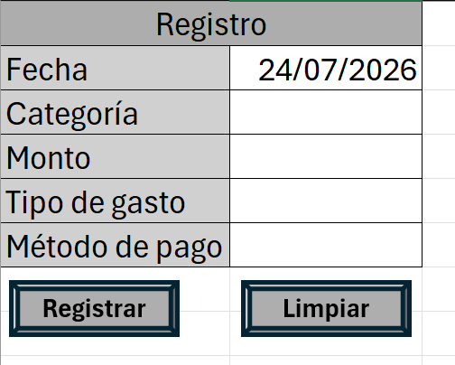
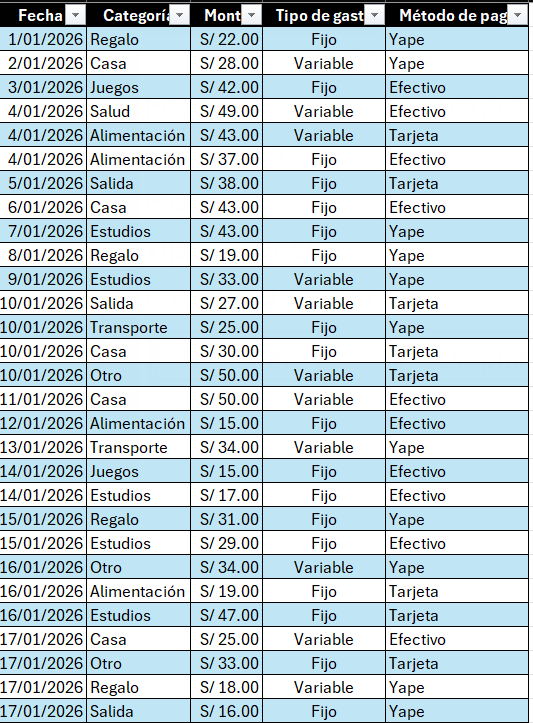
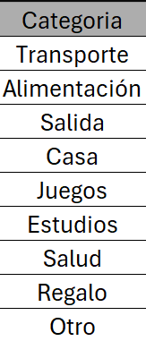
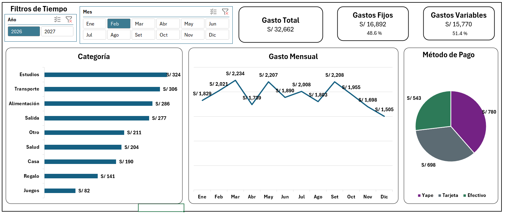

# 📊 Dashboard de Control Financiero y Registro de Gastos en Excel (Power Pivot & VBA)

Un sistema integral e interactivo de **Control Financiero Personal** desarrollado en **Microsoft Excel**, que combina el registro automatizado mediante **Macros (VBA)**, la validación estricta de datos, el **Modelado de Datos con Power Pivot**, medidas en **DAX** y un **Dashboard dinámico de alta usabilidad**.

---

## 📑 Contenido
1. [Visión General del Proyecto](#-visión-general-del-proyecto)
2. [Arquitectura y Estructura del Libro](#-arquitectura-y-estructura-del-libro)
3. [Automatización y Registro (Macros & Validación)](#-automatización-y-registro-macros--validación)
4. [Modelado de Datos y DAX (Power Pivot)](#-modelado-de-datos-y-dax-power-pivot)
5. [Capturas e Interfaz del Dashboard](#-capturas-e-interfaz-del-dashboard)
6. [Guía de Personalización para el Usuario](#-guía-de-personalización-para-el-usuario)

---

## 📌 Visión General del Proyecto

El objetivo de este proyecto es proporcionar una herramienta robusta para el registro diario de egresos y la posterior toma de decisiones financieras. 

El modelo soporta **hasta 15,000 registros** sin perder fluidez y utiliza una **Tabla Calendario dinámica** que permite navegar de forma fluida entre diferentes años y meses.

### 🛠️ Herramientas Utilizadas
* **Microsoft Excel** (Interfaz y Tablas Dinámicas)
* **VBA / Macros** (Automatización de formularios de entrada y limpieza)
* **Power Pivot** (Modelo relacional de datos de alto rendimiento)
* **Lenguaje DAX** (Cálculo de KPIs y métricas dinámicas)

---

## 🧱 Arquitectura y Estructura del Libro

El libro está distribuido en las siguientes hojas de trabajo:

1. **Registro:** Formulario automatizado para el ingreso de nuevos datos mediante botones interactivos.
2. **Gastos:** Tabla principal (`Gastos`) estructurada desde el rango `A1:E15002` donde se almacenan todos los registros históricos.
3. **Categoria:** Tabla auxiliar que define la lista oficial de categorías permitidas en el sistema.
4. **Tablas Dinámicas:** Pestaña de backend donde se alojan las tablas procesadas desde el Modelo de Datos.
5. **Dashboard:** Tablero visual consolidado para el análisis ejecutivo de las finanzas.

---

## ⚙️ Automatización y Registro (Macros & Validación)

### 1. Formulario de Entrada y Validaciones de Datos
Para garantizar la integridad y calidad de la base de datos desde el origen, el formulario de registro cuenta con reglas estrictas:

| Campo | Regla de Validación | Detalle / Configuración |
| :--- | :--- | :--- |
| **Fecha** | Permitir: Fecha | Acepta únicamente fechas desde el `01/01/2026` en adelante. |
| **Categoría** | Permitir: Lista | Vinculada dinámicamente al rango de la tabla `Categoria`. |
| **Monto** | Permitir: Decimal | Acepta valores numéricos positivos mayores a cero (`> 0`) en formato moneda (`S/`). |
| **Tipo de gasto** | Permitir: Lista | Validación textual fija: `Fijo;Variable`. |
| **Método de pago** | Permitir: Lista | Validación textual fija: `Efectivo;Tarjeta;Yape`. |

### 2. Macros del Sistema (VBA)

* **`Registrar`:**
  * Valida que **todas las celdas necesarias** estén completas; de lo contrario, despliega un aviso emergente advirtiendo los campos faltantes.
  * Identifica automáticamente la primera fila disponible al final de la tabla `Gastos`.
  * **Pasa únicamente los valores planos** (sin fórmulas ni formatos del formulario), asegurando que los registros históricos queden congelados y no pesen en memoria.
  * Restablece el formulario dejando las celdas vacías, a excepción del campo **Fecha**, donde coloca automáticamente la función `=HOY()`.
* **`Limpiar`:** Vacía todas las celdas de entrada del formulario y asigna la fecha del día corriente (`=HOY()`) en el campo Fecha.

---

## 🧮 Modelado de Datos y DAX (Power Pivot)

Se conectó la tabla de hechos `Gastos` con una **Tabla Calendario automática** en Power Pivot, permitiendo evaluar la evolución temporal continua sin importar cuándo se agreguen nuevos egresos.

### Medidas DAX Implementadas

```dax
-- Gasto Total Consolidado
Gasto Total := SUM(Gastos[Monto])

-- Gastos Fijos
Gastos Fijos := CALCULATE(
    SUM(Gastos[Monto]); 
    Gastos[Tipo de gasto] = "Fijo"
)

-- Gastos Variables
Gastos Variables := CALCULATE(
    SUM(Gastos[Monto]); 
    Gastos[Tipo de gasto] = "Variable"
)

-- Porcentajes de Participación
% Gastos Fijos := DIVIDE([Gastos Fijos]; [Gasto Total]; 0)
% Gastos Variables := DIVIDE([Gastos Variables]; [Gasto Total]; 0)
```
---

## 🖼️ Capturas e Interfaz del Dashboard

### 1. Formulario de Registro de Datos
Interfaz intuitiva asistida por botones de acción conectados a VBA para un llenado rápido y libre de errores humanos.


### 2. Base de Datos Histórica (`Gastos`)
Estructura en formato de tabla de Excel que almacena la información consolidada con formato de moneda local.


### 3. Matriz de Categorías Permitidas (`Categoria`)
Tabla maestra independiente que sirve como catálogo para la validación de categorías.



### 4. Tablas Dinámicas (Backend)
Matriz de soporte desde donde se extrae la información modelada en Power Pivot para alimentar cada gráfico.


### 5. Dashboard Principal
Diseñado bajo principios de **UI/UX**, combinando tarjetas de KPI, ordenamiento de categorías de mayor a menor y una paleta de colores contextual (Verde billete para *Efectivo*, Morado corporativo para *Yape* y Gris platino para *Tarjeta*).

> **Nota de comportamiento:** El gráfico de **Gasto Mensual** está conectado únicamente al segmentador de **Año**, lo que permite apreciar la tendencia continua de los 12 meses sin verse recortado al filtrar un mes en específico.



---

## 🛠️ Guía de Personalización para el Usuario

Si deseas descargar esta plantilla y adaptarla a tus propias finanzas o agregar nuevas columnas, sigue estas pautas:

### 1. ¿Cómo agregar o cambiar Categorías?
* Ve a la hoja donde se encuentra la tabla `Categoria`.
* Inserta una celda antes del último valor para esta nueva categoría.
* Escribe la nueva categoría en la celda añadida, así la tabla se expandirá automáticamente con este nuevo valor.
* La lista desplegable del formulario de **Registro** la detectará de inmediato sin necesidad de tocar la validación de datos.

### 2. ¿Cómo modificar los Tipos de Gasto o Métodos de Pago?
* Selecciona la celda de la hoja de **Registro** correspondiente a *Tipo de gasto* o *Método de pago*.
* Ve a la pestaña **Datos** -> **Validación de datos**.
* En el campo *Origen*, edita el texto separado por punto y coma (ejemplo: `Efectivo;Tarjeta;Yape;Transferencia`).
* *Nota:* Si cambias los nombres de los métodos de pago o tipos de gasto, recuerda actualizar los textos dentro de las medidas DAX en Power Pivot y volver a asignar los colores en la gráfica.

### 3. ¿Cómo añadir una nueva columna al registro?
* Inserta la nueva columna tanto en el formulario de la hoja **Registro** como en la tabla `Gastos`.
* Debes ingresar al editor de VBA (`Alt + F11`) y ajustar la macro `Registrar` para que copie la nueva celda hacia la columna correspondiente en la tabla `Gastos`.